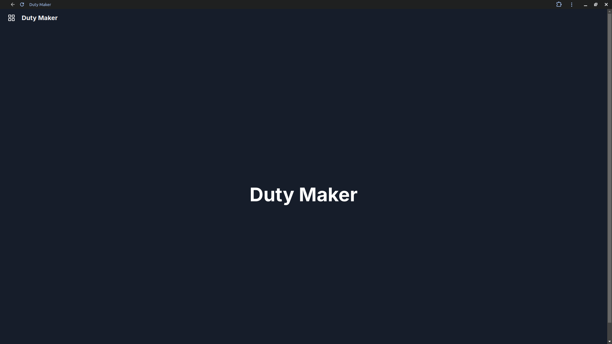
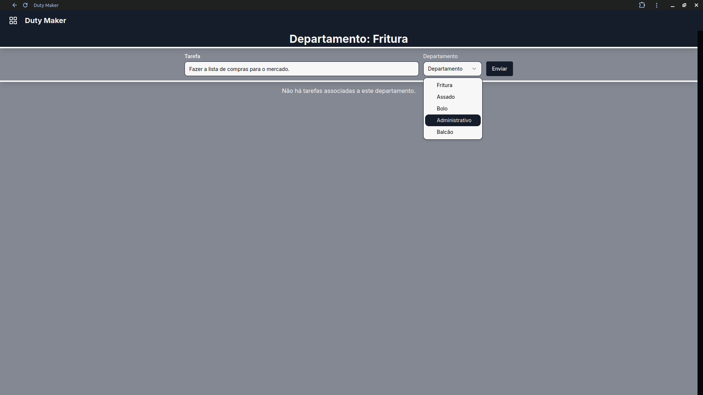
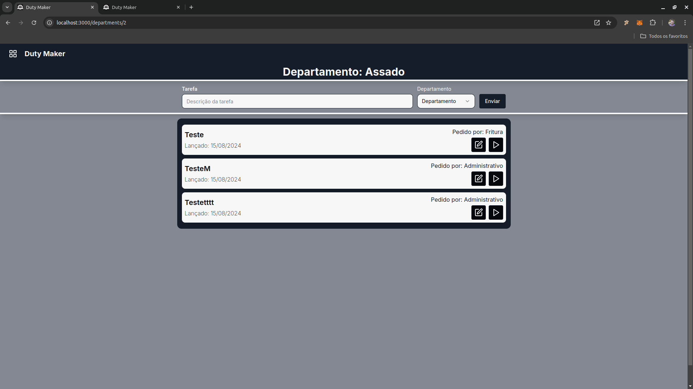
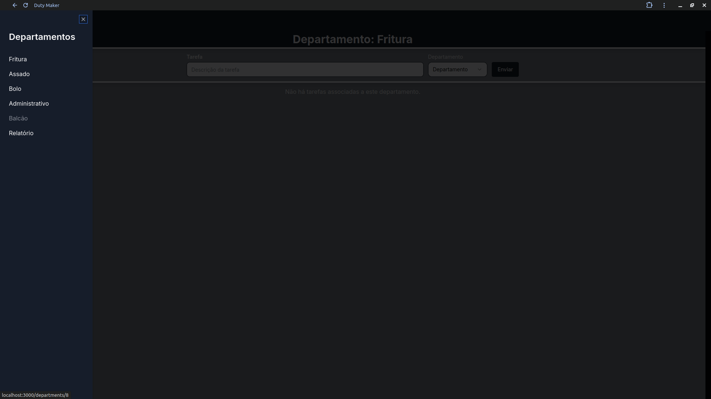
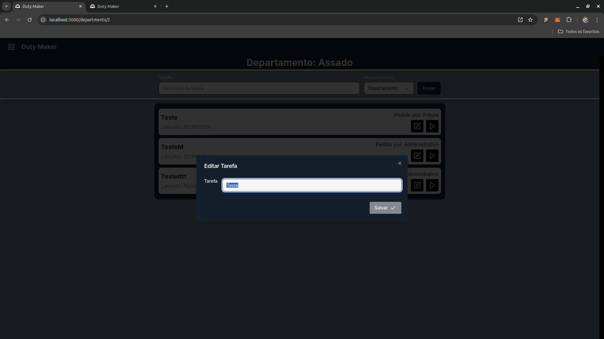
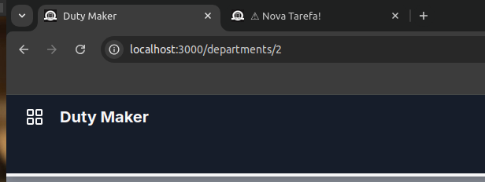

# ToDo com Departamentos

Este projeto é uma aplicação de gerenciamento de tarefas (ToDo) com suporte a departamentos, desenvolvida utilizando Next.js, Prisma, Tailwind CSS e a biblioteca Shadcn. A aplicação permite criar, editar e visualizar tarefas, organizadas por departamentos.

## Tecnologias Utilizadas

- **Next.js 14.2.5**: Framework React para construção de aplicações web.
- **Prisma 5.18.0**: ORM utilizado para manipulação do banco de dados.
- **Tailwind CSS 3.4.1**: Framework de CSS utilitário para estilização da interface.
- **Shadcn**: Biblioteca de componentes para uma melhor experiência de usuário.

## Funcionalidades

- **Tela Inicial**: Página principal do aplicativo, onde são listadas as tarefas mais recentes e as ações disponíveis.
  

- **Adicionar Nova Tarefa**: Interface para adicionar uma nova tarefa, permitindo associá-la a um departamento específico.
  

- **Visualização de Tarefas**: Página onde são listadas todas as tarefas existentes, com opções de filtragem e ordenação.
  

- **Menu de Departamentos**: Menu dinâmico que lista todos os departamentos disponíveis no banco de dados, permitindo a navegação por categoria.
  

- **Edição de Tarefa**: Interface para editar as informações de uma tarefa existente.
  

- **Notificações**: O sistema avisa quando há mudanças importantes, mesmo que você esteja usando outra aba no navegador.
  

## Instalação e Configuração

1. Clone este repositório:
   ```bash
   git clone https://github.com/seu-usuario/seu-repositorio.git
   cd seu-repositorio

2. Instale as dependências:
  ````bash
  npm install
  npx prisma migrate dev
  npm run dev
